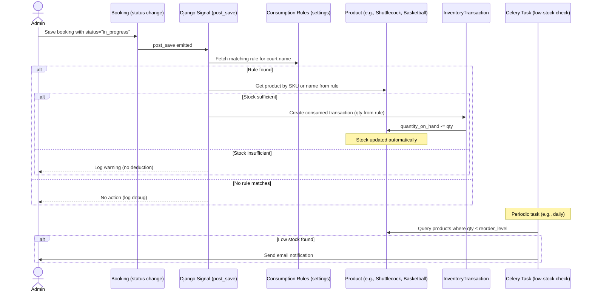

# Inventory Module – Design & Integration Guide

This document defines the **single recommended approach** for adding an inventory module to the Badminton Court Management system (and any future sports).  
It builds on the existing Django backend, uses Django Admin for management, and integrates automatically with bookings via configurable consumption rules. No extra front‑end work is required.

---

## 1. General Design Specification

### 1.1 Architecture Overview
- **New Django App** `inventory` – lives alongside `badminton_court` and `court_management`.
- **Database** – same SQLite (or MariaDB) used by the project; no separate data store.
- **Admin Panel** – staff manage categories, suppliers, products, stock levels, and transactions entirely through Django Admin (see `inventory/admin.py`).
- **Integration Hooks** – a Django signal automatically deducts a configurable amount of a designated product when a booking becomes “in_progress” (the point of actual resource use).
- **Alerts** – a Celery periodic task checks stock levels against reorder thresholds and sends email notifications to admins.
- **Testing** – Cypress tests for admin workflows (add product, record transaction) placed under `cypress/e2e/inventory/`.

### 1.2 Core Models
- **InventoryCategory** – groups products (e.g., shuttlecocks, rackets, basketballs, nets).
- **Supplier** – contact details for restocking.
- **Product** – represents any inventory item that can be stocked, sold, or consumed. Tracks SKU, quantity on hand, reorder level, unit cost, selling price, location, condition, supplier, and category.
- **InventoryTransaction** – immutable record of every stock movement (stock in, stock out, consumed, damaged, inventory adjustment).  
  A custom `save()` method automatically updates the related `Product.quantity_on_hand`, keeping audit trail and stock quantity synchronised.

### 1.3 Integration Points
- **Bookings** – when a booking’s status changes to `'in_progress'`, a signal consults the `INVENTORY_CONSUMPTION_RULES` setting. It matches the court’s name against defined patterns, locates the corresponding product (by SKU or name), and deducts a configured quantity. This works for badminton, basketball, tennis, etc., without code changes.
- **Events / Tournaments** – can be integrated later using the same pattern (additional signals or manual transactions).
- **Reports** – since all stock movements are stored in `InventoryTransaction`, the existing analytics module can directly query for usage, cost, and popularity reports.
- **Low‑stock alerts** – the Celery task `check_low_stock` runs on a schedule and emails admins when any active product’s `quantity_on_hand` falls below its `reorder_level`.

### 1.4 Technology Choices
| Component          | Choice                       | Reason |
|-------------------|-------------------------------|--------|
| Backend framework | Django (existing)             | Consistent with project |
| Database          | SQLite (default)              | No new infrastructure |
| Admin interface   | Django Admin                  | Quick, zero‑code backend |
| Async tasks       | Celery + `django_celery_beat` | Re‑uses existing queue |
| Testing           | Cypress                       | Existing test framework |

---

## 2. Process Flow Diagram & Explanation

The inventory lifecycle, now sport‑agnostic:

```
[Admin] → Add Category → Add Supplier → Add Product (with reorder level)
                ↓
[Admin or System] → Record Transaction (In/Out/Consumed)
                ↓
       Transaction.save() updates Product.quantity_on_hand
                ↓
   If quantity ≤ reorder level → trigger low‑stock alert (Celery task)
                ↓
[Booking becomes in_progress] → signal matches court to a rule
                ↓
       Deduct configured product (e.g., 2 shuttlecocks) via transaction
                ↓
[Admin] → views inventory dashboard, restocks as needed
```

**Explanation:**
1. **Setup**: Administrator defines categories, suppliers, and products (each with reorder level, SKU, and initial stock).
2. **Daily operations**: All stock changes are entered as `InventoryTransaction` records. The system maintains an exact audit trail and automatically updates the product’s `quantity_on_hand`.
3. **Automatic consumption on bookings**: When a booking starts (status `'in_progress'`), the signal picks the matching rule from `INVENTORY_CONSUMPTION_RULES` based on the court name, finds the product, and creates a “consumed” transaction. This works for any sport – simply add a new rule in settings.
4. **Alerting**: A Celery Beat periodic task scans all active products and emails the admin list whenever `quantity_on_hand` ≤ `reorder_level`.
5. **Restocking**: When new stock arrives, an admin enters a “Stock In” transaction, increasing the quantity on hand.
6. **Reporting**: The `InventoryTransaction` model serves as a complete data source for future reports.

---

## 3. Sequence Diagram – Booking Creates Inventory Deduction

The following diagram shows the flow when a booking is started, using configurable rules.



**How to read the diagram:**  
- The admin sets a booking to `'in_progress'`.  
- The signal checks the consumption rules based on the court name.  
- If a rule matches, the designated product is deducted by the rule’s `quantity_per_booking`.  
- If stock is insufficient, only a warning is logged – the booking itself is not blocked (configurable).  
- Separately, the Celery task ensures admins are notified about low‑stock items.

---

## 4. Implementation Roadmap

### Step 1 – Create the `inventory` app
```bash
python manage.py startapp inventory
```

### Step 2 – Add `inventory` to `INSTALLED_APPS` and configure settings
- In `badminton_court/settings/__init__.py` (or `base.py`), include `'inventory'` in `INSTALLED_APPS`.
- Create/update `badminton_court/settings/inventory.py` with your consumption rules. Example:
```python
INVENTORY_CONSUMPTION_RULES = [
    {
        'court_names': ['badminton', 'court a', 'court b'],
        'product_sku': 'SHUTTLE',
        'product_name': 'Shuttlecock',   # fallback if SKU not found
        'quantity_per_booking': 2,
    },
    {
        'court_names': ['basketball'],
        'product_sku': 'BASKETBALL',
        'product_name': 'Indoor Basketball',
        'quantity_per_booking': 1,
    },
]
```
- Make sure `badminton_court/settings/__init__.py` imports this module: `from .inventory import *`.

### Step 3 – Define models (`inventory/models.py`)
Use the provided `Product`, `InventoryCategory`, `Supplier`, and `InventoryTransaction` models (see the final code block below or the earlier supplied models). The `InventoryTransaction.save()` method automatically updates `Product.quantity_on_hand`.

### Step 4 – Register models with the Admin (`inventory/admin.py`)
Use the admin registration that includes `list_display`, `list_filter`, `search_fields`, and the inline `InventoryTransactionInline` on `ProductAdmin`. (The exact code was given earlier.)

### Step 5 – Set up the booking consumption signal (`inventory/signals.py`)
- Create the signal file that connects to `post_save` of `'court_management.components.models.Booking'`.
- The signal reads `INVENTORY_CONSUMPTION_RULES` from settings and deducts the appropriate product when a booking becomes `'in_progress'`.
- It prevents duplicate transactions by using a unique reference (`Booking #<id>`).
- Ensure the signal is loaded by adding a `ready()` method in `inventory/apps.py`:
```python
def ready(self):
    import inventory.signals
```

### Step 6 – Add the Celery low‑stock alert task (`inventory/tasks.py`)
- Define `check_low_stock` task that finds all active products with `quantity_on_hand <= reorder_level` and emails `ADMINS`.

### Step 7 – Run migrations
```bash
python manage.py makemigrations inventory
python manage.py migrate inventory
```

### Step 8 – Schedule the low‑stock alert in Celery Beat
1. Ensure Celery Beat (with `django_celery_beat`) is running as part of your Docker setup or management commands.
2. Go to Django Admin → **Periodic tasks** (under “django_celery_beat”).
3. Click **Add Periodic Task**:
   - **Name**: `Check low stock`
   - **Task (registered)**: `inventory.tasks.check_low_stock`
   - **Schedule**: create a crontab schedule (e.g., `0 8 * * *` for daily at 8 AM) or an interval schedule (e.g., every 4 hours).
4. Save. The task will now run automatically.

### Step 9 – (Optional) Add Cypress tests
- Create test files under `cypress/e2e/inventory/` to verify:
  - Adding a product via admin
  - Recording a stock‑in transaction
  - Checking low‑stock alert display (simulate low stock and verify email/content)

### Step 10 – Deploy with Docker (if needed)
If `requirements.txt` hasn't changed, a simple restart is enough. Otherwise rebuild:
```bash
docker-compose down && docker-compose build && docker-compose up -d
docker-compose exec web python manage.py migrate
```

---

## 5. Files & Configuration Summary

| File / Location | Purpose |
|-----------------|---------|
| `inventory/models.py` | Product, InventoryCategory, Supplier, InventoryTransaction with auto‑stock update |
| `inventory/admin.py` | Admin registration with inline transactions |
| `inventory/signals.py` | Signal that consumes products based on booking `in_progress` and court rules |
| `inventory/tasks.py` | `check_low_stock` Celery task for email alerts |
| `inventory/apps.py` | Must include `ready()` to import signals |
| `badminton_court/settings/inventory.py` | `INVENTORY_CONSUMPTION_RULES` list (sport‑agnostic) |
| `badminton_court/settings/__init__.py` | Imports `from .inventory import *` |

---

*This updated guide enables a reusable, sport‑agnostic inventory module that integrates seamlessly with your booking system, requires no code changes for new sports, and keeps you informed about stock levels automatically.*