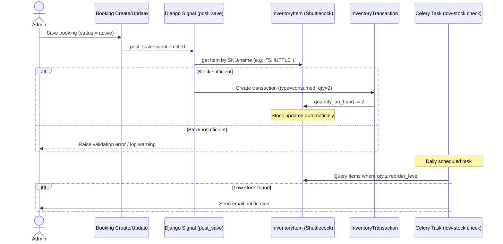

# Inventory Module – Design & Integration Guide

This document defines the **single recommended approach** for adding an inventory module to the Badminton Court Management system.  
It builds on the existing Django backend, uses the admin interface for day‑to‑day management, and integrates seamlessly with bookings and events via Django signals. No extra front‑end work is required to get started.

---

## 1. General Design Specification

### 1.1 Architecture Overview
- **New Django App** `inventory` – lives alongside `badminton_court` and `court_management`.
- **Database** – same SQLite (or MariaDB) used by the project; no separate data store.
- **Admin Panel** – staff manage items, stock levels, suppliers, and transactions entirely through Django Admin.
- **Integration Hooks** – Django signals automatically adjust inventory when a booking is created or an event consumes resources.
- **Alerts** – a Celery periodic task checks stock levels and sends email notifications to admins.
- **Testing** – Cypress tests for admin workflows (add item, record transaction) are added under `cypress/e2e/inventory/`.

### 1.2 Core Models
- **InventoryCategory** – rackets, shuttlecocks, nets, consumables, etc.
- **Supplier** – contact details for restocking.
- **InventoryItem** – tracks name, SKU, quantity on hand, reorder level, unit cost, location, condition.
- **InventoryTransaction** – every stock movement (in, out, consumed, damaged) is recorded here.  
  A `save()` override automatically updates `InventoryItem.quantity_on_hand`.

### 1.3 Integration Points
- **Bookings** – when a booking status becomes “active”, a signal deducts a configurable number of shuttlecocks (e.g., 2) from a designated “Shuttlecock” item.
- **Events / Tournaments** – similar signal logic for bulk item consumption.
- **Reports** – the existing analytics module can later query `InventoryTransaction` to produce usage and cost reports.

### 1.4 Technology Choices
| Component          | Choice                          | Reason |
|-------------------|----------------------------------|--------|
| Backend framework | Django (existing)                | Consistent with project |
| Database          | SQLite (default)                 | No new infrastructure |
| Admin interface   | Django Admin                     | Quick, zero‑code backend |
| Async tasks       | Celery + `django_celery_beat`    | Re‑uses existing queue |
| Testing           | Cypress                          | Existing test framework |

---

## 2. Process Flow Diagram & Explanation

The main inventory lifecycle follows these steps:

```
[Admin] → Add Category → Add Supplier → Add Item (with reorder level)
                ↓
[Admin or System] → Record Transaction (In/Out/Consumed)
                ↓
       Transaction.save() updates item quantity
                ↓
         If quantity ≤ reorder level → trigger low‑stock alert (Celery)
                ↓
[Booking Created] → booking signal checks item “Shuttlecock” and consumes X units
                ↓
[Admin] → views inventory dashboard in Django Admin, restocks as needed
```

**Explanation:**
1. **Setup**: Administrator defines categories (e.g., “Shuttlecocks”), suppliers, and items. Each item has a reorder level and initial stock.
2. **Daily operations**: All stock changes are entered as transactions. The system keeps an immutable audit trail and automatically adjusts the quantity on hand.
3. **Automation**: When a booking is saved with status “active”, a signal fires, finds the item named “Shuttlecock” (or a configured SKU), and creates an `InventoryTransaction` of type “consumed”. The same signal can be reused for events.
4. **Alerting**: A Celery Beat task runs once daily (configurable) and emails admins a list of items where `quantity_on_hand <= reorder_level`.
5. **Restocking**: When new stock arrives, an admin records a “Stock In” transaction, which increases the quantity.
6. **Reporting**: All transaction data is stored in Django models, so future reports can be built directly from `InventoryTransaction` using Django’s ORM.

---

## 3. Sequence Diagram – Booking Creates Inventory Deduction

The following diagram shows the flow when a booking is created and how it automatically consumes inventory.



**How to read the diagram:**  
- The admin saves a booking with status “active”.  
- Django’s `post_save` signal triggers the inventory deduction logic.  
- If stock is enough, a “consumed” transaction is created and the item’s quantity drops by a predefined amount (default: 2).  
- If stock is too low, the booking is still saved but the system raises an alert (and optionally can refuse the booking – configurable).  
- Separately, Celery’s periodic task scans all items and alerts on low stock.

---

## 4. Implementation Roadmap

1. **Create the `inventory` app**  
   ```bash
   python manage.py startapp inventory
   ```

2. **Define models** (`inventory/models.py`) as described in Section 1.2.

3. **Register models with Admin** (`inventory/admin.py`), adding list displays, filters, and search.

4. **Write the booking signal**  
   In `inventory/signals.py`, connect to the `Booking` model’s `post_save`. When status becomes active, find the shuttlecock item and create a consumption transaction.

5. **Add Celery periodic task**  
   In a file like `inventory/tasks.py`, define a task that checks low‑stock items and sends email (re‑use existing email settings). Schedule it in the Celery Beat database.

6. **Run migrations and test**  
   ```bash
   python manage.py makemigrations inventory
   python manage.py migrate inventory
   python manage.py runserver
   ```

7. **Add Cypress tests**  
   Under `cypress/e2e/inventory/`, create test files for:
   - Adding an item via admin
   - Recording a stock‑in transaction
   - Verifying low‑stock alert in the admin panel

8. **Deploy with Docker**  
   Rebuild containers if `requirements.txt` changed:
   ```bash
   docker-compose down && docker-compose build && docker-compose up -d
   docker-compose exec web python manage.py migrate
   ```

---

*This design keeps the module self‑contained, leverages your existing stack, and provides immediate value without adding complexity.*